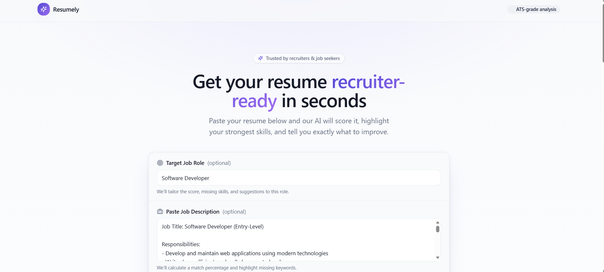
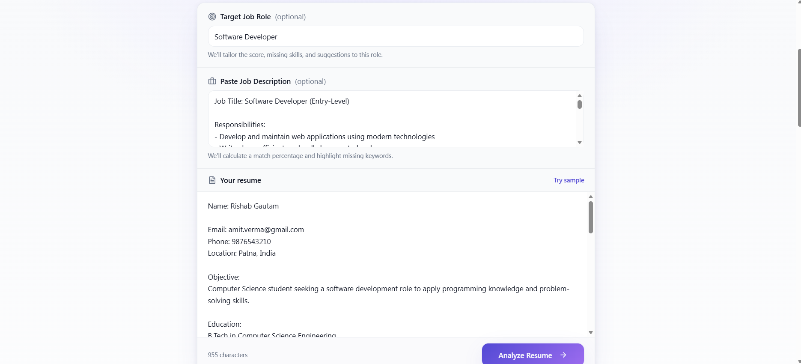
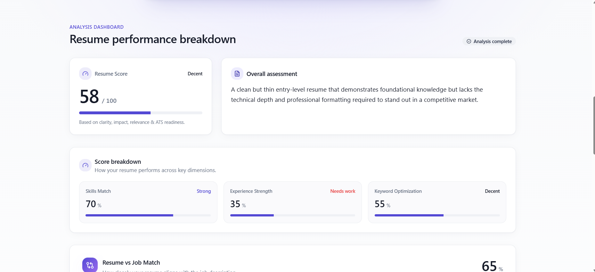
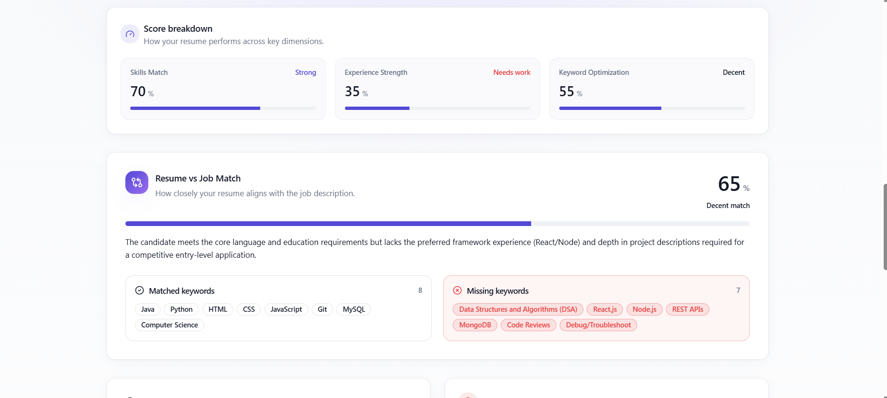
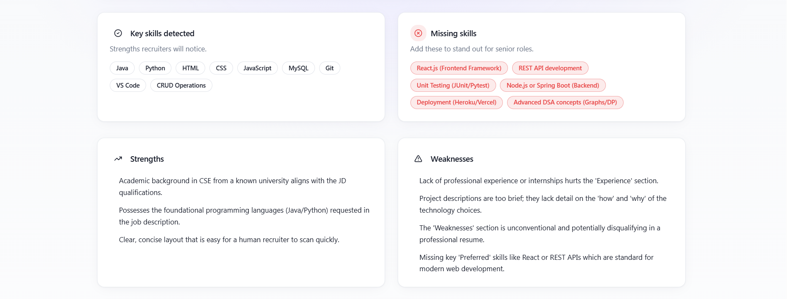
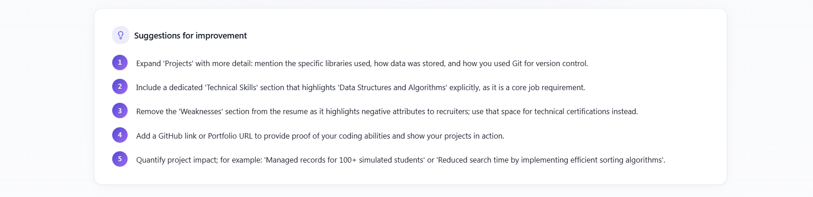

AI Resume Analyzer

## Overview

This project is a resume analysis system that simulates how Applicant Tracking Systems (ATS) evaluate resumes. It analyzes resume content, identifies key skills, compares them with job requirements, and generates a structured performance report. It analyzes resume content, extracts important skills, compares them with job requirements, and generates a structured performance report.

---

## How It Works

1. User enters resume text into the system
2. The system scans for keywords, skills, and structure
3. It compares the resume with a job description
4. It generates:
   - Resume Score (out of 100)
   - Skills Match Percentage
   - Missing Keywords
   - Strengths & Weaknesses
   - Suggestions for improvement

---

## Features

- Resume scoring system
- Skill detection and keyword extraction
- Resume vs Job Description matching
- Missing skills identification
- Structured improvement suggestions

---

## Screenshots

### 1. Home Page

### 2. Resume Input

### 3. Analysis Result

### 4. Score Breakdown

### 5. Job Match

### 6. Suggestions

---

## Tech Stack

- Lovable AI (UI + logic generation)
- AI-based keyword analysis approach

---

## Limitations

- Frontend-based implementation (no backend)
- Uses simulated logic instead of real ML model

---

## Future Improvements

- Add backend (Node.js / Spring Boot)
- Integrate real NLP/AI models
- Enable PDF resume upload
- Deploy as a full-stack web application

---

## Author
Sahil Singh   
B.Tech CSE Student | Actively learning and building projects
